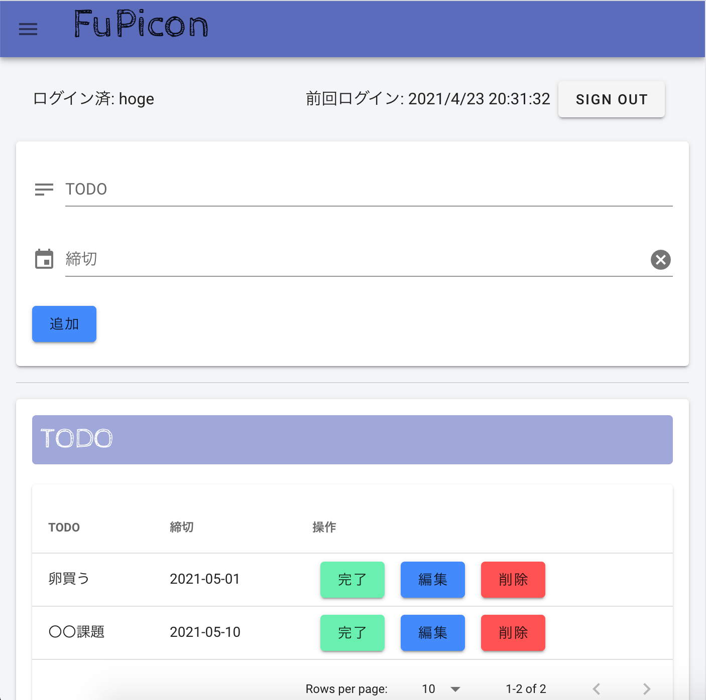
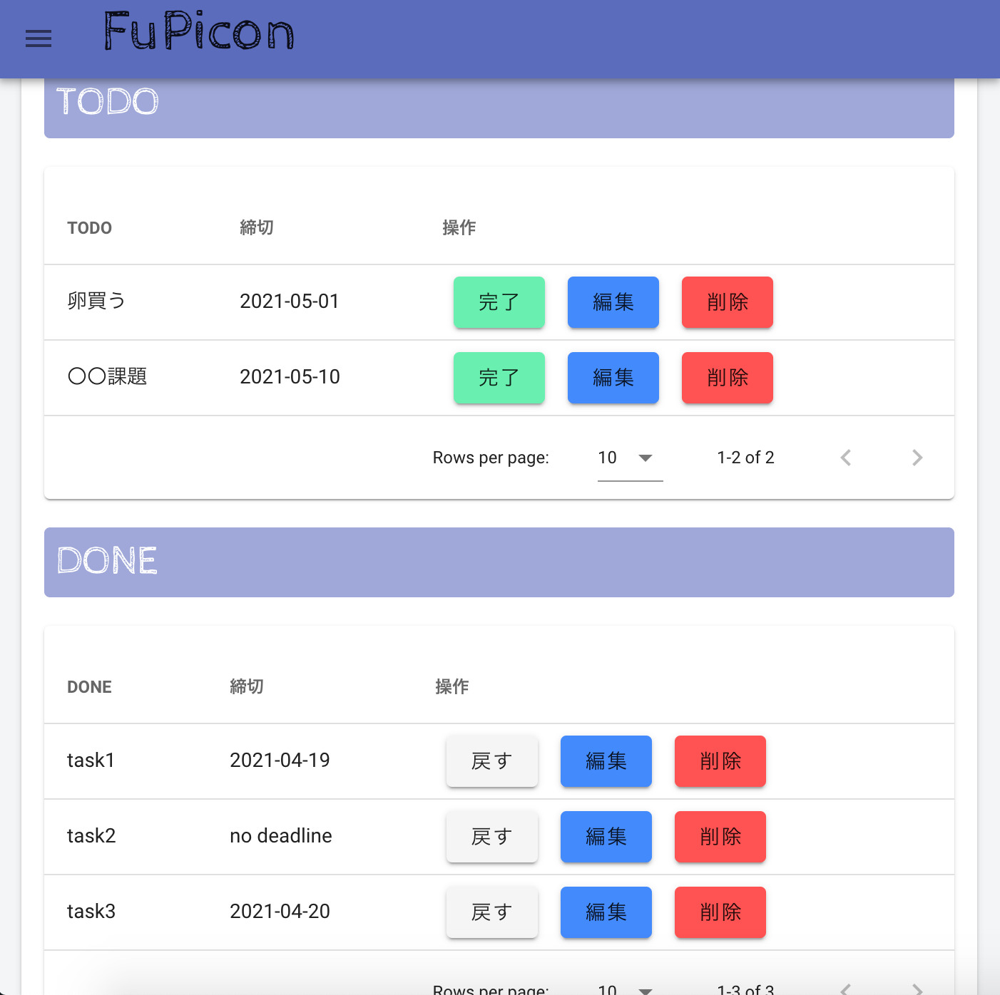
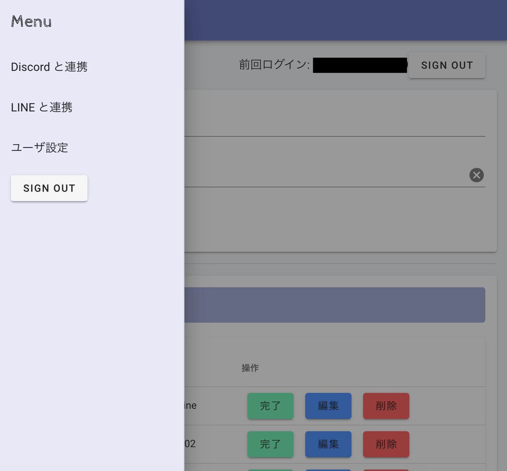
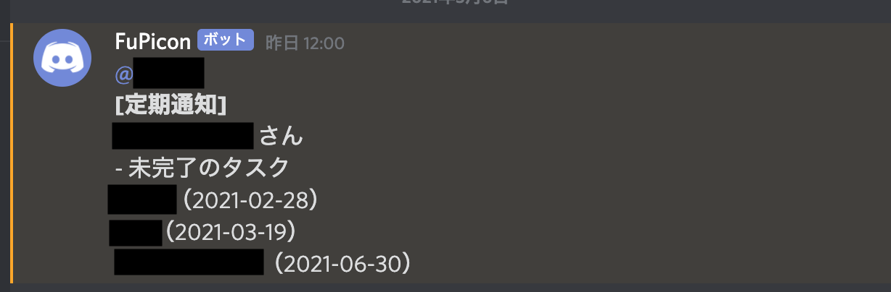
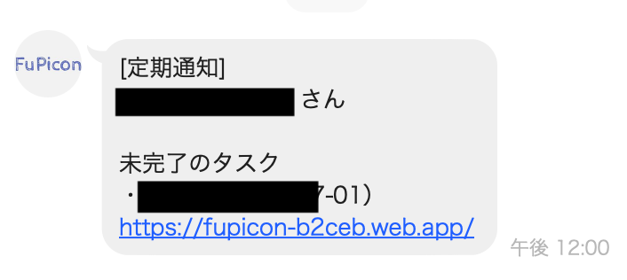

# <a href="https://fupicon-b2ceb.web.app/" target="_blank">FuPicon</a>


|スクリーンショット1|スクリーンショット2|スクリーンショット3|
|-|-|-|
||||


## 概要
- <a href="https://fupicon-b2ceb.web.app/" target="_blank">アプリのページはこちら</a>
- シンプルなタスク管理アプリ
  - ユーザ認証機能
  - 完了（DONE）、未完了（TODO）のタスクを分けて管理
  - **Discord との連携機能**
  - **LINE との連携機能**

|Discord 連携時|LINE 連携時|
|-|-|
|||
- 毎日通知してくれるので、予めタスクを登録しておくと忘れずに済みます。

---
## 使用技術
- Vue.js
  - Vuetify
  - Vue Router
- Bootstrap
- Firebase
  - Hosting
  - Authentication
  - Realtime Database
  - Functions
  - Firestore


## 開発
```bash
git clone https://github.com/yousukeayada/fupicon.git
npm install
npm run serve
```
